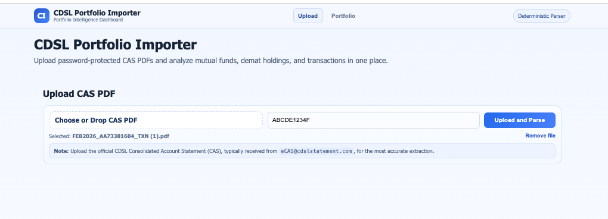
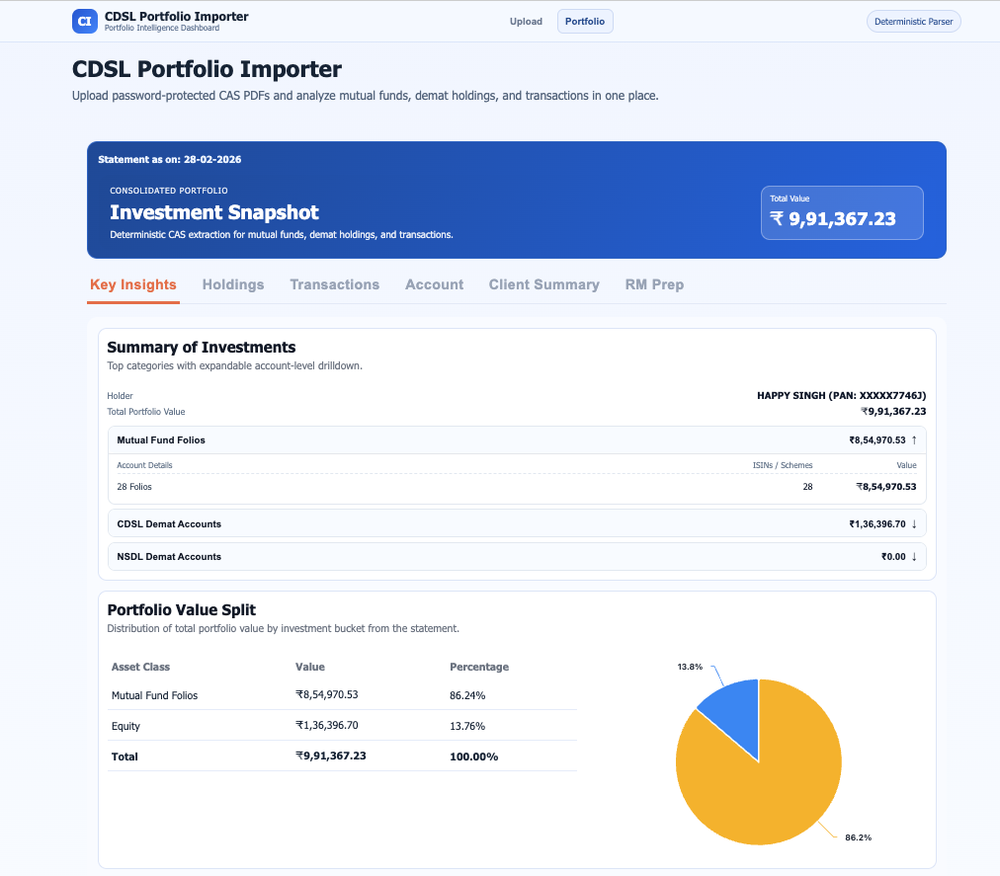
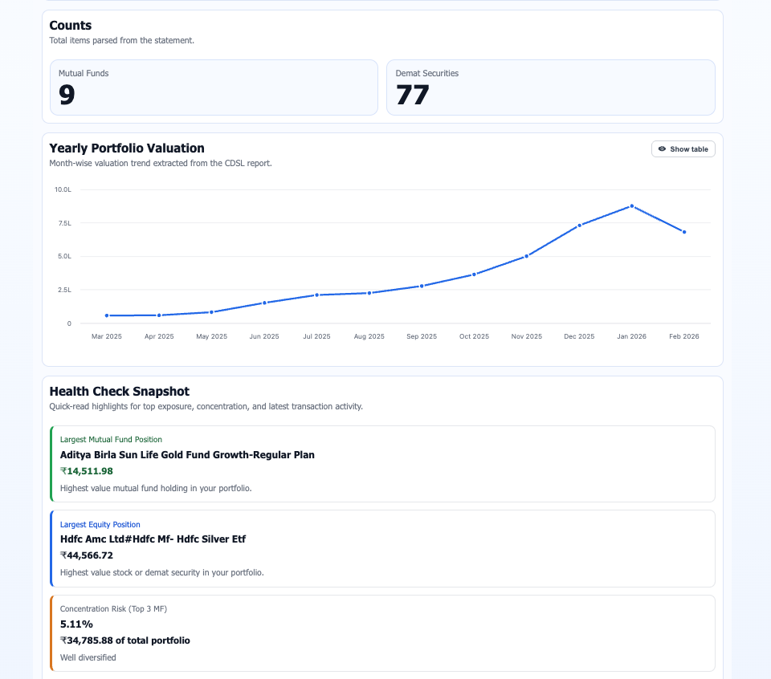
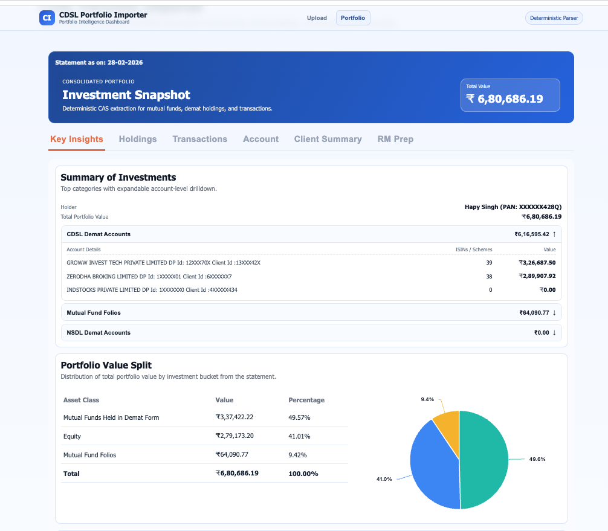
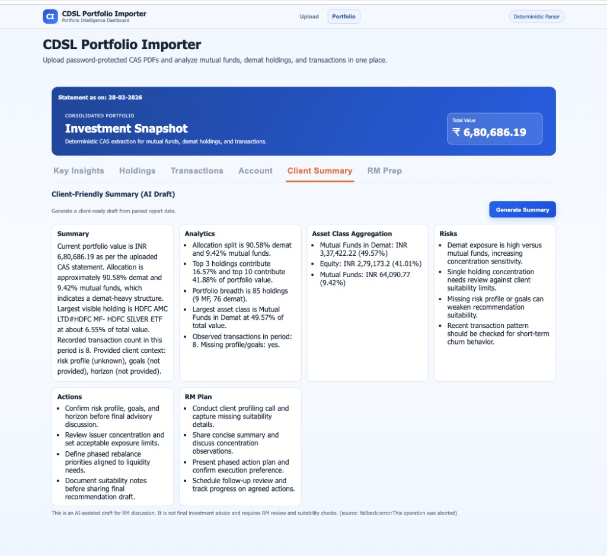

# CAS Importer

Full-stack CAS parser + analytics workspace for CDSL statements.

Upload PDF statements (including password-protected files) and get:

- Mutual fund holdings and transactions
- Demat holdings and transactions
- Consolidated summary, asset class breakup, yearly valuation
- AI-powered **Client Summary** (analytics-oriented)
- AI-powered **RM Meeting Prep**

## Project Structure

- `cas-importer/backend/` - Express API + parser + AI services
- `cas-importer/frontend/` - React dashboard
- `cas-importer/backend/data/reports/` - saved parsed JSON reports

## Quick Start

### 1) Backend

```bash
cd cas-importer/backend
npm install
cp .env.example .env
node server.js
```

Backend runs on `http://localhost:5001` by default.

### 2) Frontend

```bash
cd cas-importer/frontend
npm install
npm start
```

Frontend runs on `3000` (or next available port).

## Environment Variables (Safe For Git)

Use `cas-importer/backend/.env.example` as template:

```bash
OPENAI_API_KEY=your_openai_api_key_here
OPENAI_CLIENT_SUMMARY_MODEL=gpt-4.1-mini
OPENAI_RM_PREP_MODEL=gpt-4.1-mini
PORT=5001
```

Notes:

- Keep your real key only in local `cas-importer/backend/.env`.
- `.env` is git-ignored, so it will not be pushed.
- Teammates can clone, copy `.env.example` -> `.env`, add their key, and run immediately.

## API

### `POST /api/upload-cas`

Form-data:

- `file` (required) - CAS PDF
- `password` (optional) - PDF password (uppercase recommended)

Returns parsed portfolio JSON including holdings, transactions, and summary blocks.

### Saved Report APIs

- `GET /api/reports/:reportId` - fetch saved parsed JSON
- `GET /api/reports/:reportId/download` - download saved JSON

### AI APIs

- `POST /api/reports/:reportId/client-summary`
  - Generates client-facing summary with analytics + actions
- `POST /api/reports/:reportId/rm-meeting-prep`
  - Generates RM agenda, questions, objection handling, and checklist

## Example Curl

```bash
curl -X POST "http://localhost:5001/api/upload-cas" \
  -F "file=@/absolute/path/to/statement.pdf" \
  -F "password=YOUR_PDF_PASSWORD"
```

## UI Screenshots And Demo Video

### Upload View



### Key Insights View



### Key Insights View (Expanded)


### Key Insights View (Metrics)



### Key Insights View (Redacted)



### Client Summary View



Add remaining screenshots/video under `docs/media/` using these names:

- `ui-rm-prep.png`
- `cas-importer-demo.mp4`

Then update this section with markdown embeds/links.
